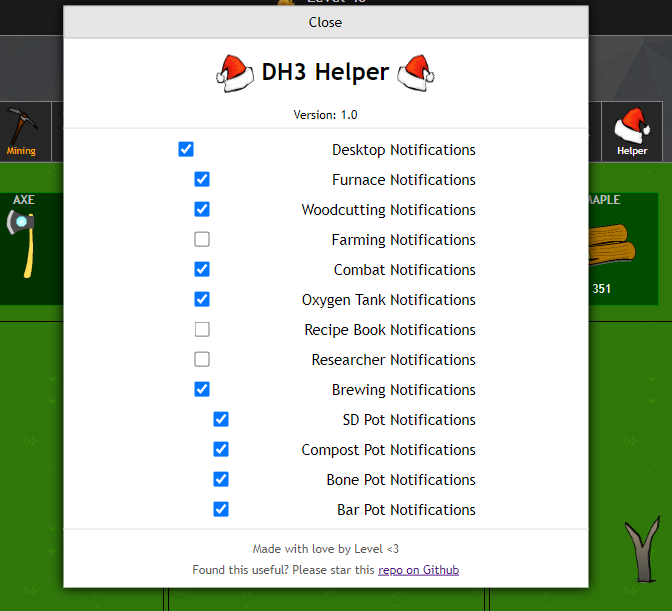

# DH3 Helper Extension

An extension script to the popular idle game [https://dh3.diamondhunt.co/](https://dh3.diamondhunt.co/) to allow desktop notifications.

## Features

- Furnace Notifications
- Wooductting Notifications
- Farming Notifications
- Combat Notifications
- Oxygen Tank Notifications
- Recipe Book Notifications
- Potion Notifications
  - SD Pot Notifications
  - Compost Pot Notifications
  - Bone Pot Notifications
  - Bar Pot Notifications

## Installation

1. Install a userscript manager such as Tampermonkey
 a. Tampermonkey for Chrome [https://chrome.google.com/webstore/detail/tampermonkey/dhdgffkkebhmkfjojejmpbldmpobfkfo](https://chrome.google.com/webstore/detail/tampermonkey/dhdgffkkebhmkfjojejmpbldmpobfkfo)
 b. Tampermonkey for Firefox [https://addons.mozilla.org/en-US/firefox/addon/tampermonkey/](https://addons.mozilla.org/en-US/firefox/addon/tampermonkey/)
2. Create a new script
3. Copy and paste the code from the [script.js](script.js) file
4. Save the script and reload DiamondHunt 3
5. Open the newly added menu on DiamondHunt, it should be next to the "Shops" option
6. Set desktop notifcations to true and select which types of notifcations you want
7. Enjoy!

## Contributing

I welcome contributions to DH3 Helper. Feel free to create an issue regarding any bugs or desired features, and I'll respond when possible. If you want to contribute code, please fork this repository and create a pull request.

*If you need to get in contact with me, my DiamondHunt tag is Level and my Discord tag is Level#0001.*
